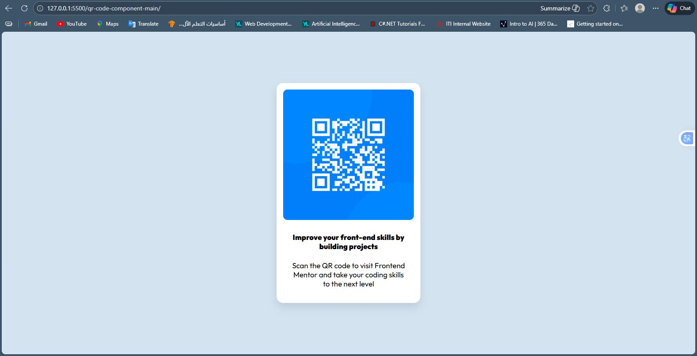

# Frontend Mentor - QR code component solution

This is a solution to the [QR code component challenge on Frontend Mentor](https://www.frontendmentor.io/challenges/qr-code-component-iux_sIO_H). Frontend Mentor challenges help you improve your coding skills by building realistic projects. 

## Table of contents

- [Overview](#overview)
  - [Screenshot](#screenshot)
  - [Links](#links)
- [My process](#my-process)
  - [Built with](#built-with)
  - [What I learned](#what-i-learned)
- [Author](#author)

## Overview

### Screenshot

 
*(Note: Replace this path with your actual screenshot path once you take it)*

### Links

- Solution URL: [Add your GitHub solution URL here](https://github.com/AbdoHalem/Frontend_Mentor_QR_code_component_solution)
- Live Site URL: [Add your GitHub Pages or Netlify live URL here](https://abdohalem.github.io/Frontend_Mentor_QR_code_component_solution/)

## My process

### Built with

- Semantic HTML5 markup
- CSS custom properties
- Flexbox (used for centering the card)
- Google Fonts (Outfit)

### What I learned

In this project, I practiced how to center a component perfectly in the middle of the screen using CSS Flexbox. I also learned about using relative units and managing images within a card.

Here is the CSS snippet I used to center the card:

```css
body {
    background-color: hsl(212, 45%, 89%);
    display: flex;
    justify-content: center;
    align-items: center;
    min-height: 100vh;
    margin: 0;
}